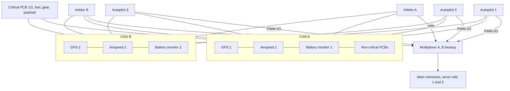

# Redundant CAN Integration Plan

Status: draft for review. Scope: how dual-redundant critical peripherals (GPS, airspeed, power, telemetry, RC, IMU) and in-house custom PCBs join a shared dual DroneCAN bus with three Pixhawk 6C/6X class autopilots, how the system behaves when parts fail, which parameters set it up, and how to check it in SITL.

Every parameter, message and test named here was checked against the source in this tree (commit `e21a6ae`). Places where stock ArduPilot does not yet do what the architecture needs are called out as **Gap** items; those are the things this fork has to build.

## 1. Baseline architecture

This plan follows the baseline drawn by the project owner (management board diagrams, October 2026). In summary:

- Three autopilots (AP1, AP2, AP3) on one management board.
- Two arbiters (A and B) score the autopilots and vote. The vote drives multiplexer-A, with multiplexer-B as backup, to select which autopilot's I/O reaches the main connector and the two servo rails.
- Two CAN buses, CAN A and CAN B. Every autopilot and both arbiters sit on both buses.
- Paired critical sensors are split across the buses: GPS 1, airspeed 1 and battery monitor 1 on CAN A; GPS 2, airspeed 2 and battery monitor 2 on CAN B.
- Critical PCBs 1 and 2 connect to both buses. Non-critical PCBs connect to CAN A only.
- Fuel/pump avionics, payload avionics and braking/landing-gear avionics hang off both buses.
- A MAVLink telemetry router (telem 1, telem 2, ADS-B), an RC splitter (RC rx 1, RC rx 2), companion computer 1, and harness computers 2 and 3 connect by serial.
- Flight surfaces and throttle are PWM servo outputs on two rails, fed through the multiplexer.



## 2. What stock ArduPilot already gives us

These behaviours exist in this tree today and the design relies on them.

| Capability | Where it lives | What it means here |
| --- | --- | --- |
| One DroneCAN driver can own two physical buses | `AP_CANManager.cpp` assigns every `CAN_Pn_` port with the same `CAN_Pn_DRIVER` to one driver; `AP_Canard_iface.cpp` sends each transfer on every interface and tags received frames with `iface_id` (`CANARD_MULTI_IFACE`) so the duplicate copy is dropped | Setting `CAN_P1_DRIVER=1` and `CAN_P2_DRIVER=1` gives each autopilot a redundant DroneCAN network across CAN A and CAN B with no extra code |
| AP_Periph speaks on two buses | `Tools/AP_Periph/Parameters.cpp`: `CAN_PROTOCOL`, `CAN2_PROTOCOL`, `CAN_NODE`, `CAN_MIRROR_PORTS` | A custom PCB built on AP_Periph can be dual-homed with parameters only |
| Two DroneCAN GPS with fixed node mapping | `GPS1_TYPE`/`GPS2_TYPE` = 9 (DroneCAN), `GPS1_CAN_OVRIDE`/`GPS2_CAN_OVRIDE`, `GPS_AUTO_SWITCH`, `GPS_PRIMARY`, `GPS_BLEND_MASK` | All three autopilots map the same receiver to the same GPS instance |
| GPS timeout | `AP_GPS.cpp`: `GPS_TIMEOUT_MS` is 4000 ms | A silent GPS node is declared lost after 4 s |
| Two DroneCAN airspeed sensors | `ARSPD_TYPE`/`ARSPD2_TYPE` = 8 (DroneCAN), `ARSPD_USE`, `ARSPD_PRIMARY`, `ARSPD_OPTIONS` (`SpeedMismatchDisable`, `UseEkf3Consistency`) | Bad airspeed is dropped by consistency checks |
| DroneCAN battery monitors | `BATT_MONITOR`/`BATT2_MONITOR` = 8 (DroneCAN-BatteryInfo), `BATTn_SERIAL_NUM` (the DroneCAN `battery_id`), `BATT_MONITOR` = 10 (sum), `BATT_FS_LOW_ACT`, `BATT_FS_CRT_ACT`, `BATT_ARM_VOLT` | Each monitor is pinned to a specific battery id |
| Node health pre-arm | `AP_DroneCAN_DNA_Server::prearm_check` reports `Duplicate Node` and `Node N unhealthy!` unless `CAN_D1_UC_OPTION` bits 1 or 3 are set | Arming is blocked when any bus node reports itself unhealthy |
| Serial ports tunnelled over DroneCAN | `CAN_D1_UC_SER_EN`, `CAN_D1_UC_S1_NOD`, `_S1_IDX`, `_S1_BD`, `_S1_PRO` (up to S3) | A radio or other serial device on a CAN node appears to the autopilot as a normal serial port |
| Custom DroneCAN messages from Lua | `DroneCAN_Handle` in `AP_Scripting` bindings (`broadcast`, `request`, `subscribe`, `check_message`); example `libraries/AP_Scripting/examples/DroneCAN_test.lua` | The autopilot can send and receive project-specific messages without patching `AP_DroneCAN` |
| Vendor DSDL in tree | `libraries/AP_DroneCAN/dsdl/` ("vendor specific DSDL for ArduPilot") | The place to define this project's own message types |
| SITL DroneCAN | `SIM_CAN_TYPE1`/`SIM_CAN_TYPE2` (multicast UDP or SocketCAN), `sitl_periph_universal`, `sim_vehicle.py --can-peripherals`, autotests `test.CAN` and `test.BattCAN` | Bus integration can be tested without hardware |

## 3. Gaps the fork has to close

These are the places where the baseline architecture asks for something stock ArduPilot does not do. Each needs its own design and review before flight.

1. **Command authority on a shared bus.** Every ArduPilot instance on a DroneCAN bus is a full master. Sensor data is broadcast, so three listeners are fine. Commands are not: if AP1, AP2 and AP3 all send relay, servo or ESC commands to the fuel, gear or payload boards, those boards receive three competing streams. Stock ArduPilot has no "standby, listen only" mode for DroneCAN output. See section 5.3 for the proposed fix.
2. **Arbiter health input.** ArduPilot's DroneCAN `NodeStatus` is sent once per second with health hard-coded to OK (`AP_DroneCAN::send_node_status`). That is too slow and too coarse for voting. The arbiters need a faster, richer heartbeat (section 5.4).
3. **External IMU over CAN.** AP_Periph can publish `uavcan.equipment.ahrs.RawIMU` (`Tools/AP_Periph/imu.cpp`), but nothing in `libraries/` consumes it. A CAN-attached IMU cannot feed the EKF today. IMU redundancy therefore comes from the IMUs on each autopilot (section 6.3).
4. **Three DNA servers.** Each autopilot always runs a dynamic node allocation server, and there is no parameter to turn it off. Three allocators on one bus can race. The fix is to avoid dynamic allocation entirely (section 5.1).
5. **Only two physical GPS per autopilot.** `GPS_MAX_RECEIVERS` is 2. This matches the paired design, but adding a third receiver would need a build change.
6. **SITL runs one physics model per vehicle.** Several SITL autopilots can share the multicast CAN bus, but each one simulates its own aircraft. A true triple-autopilot simulation with one shared airframe needs an external physics source (section 8.4).

## 4. Bus design

### 4.1 Physical layer

- Both Pixhawk 6C and 6X expose CAN1 and CAN2 (`hwdef.dat`: `PD0/PD1` for CAN1 on both boards; CAN2 on `PB12/PB13` for 6X and `PB5/PB13` for 6C). CAN1 is CAN A and CAN2 is CAN B on every autopilot. Keep that mapping identical on all three so logs compare directly.
- Start at classic CAN, 1 Mbit/s (`CAN_P1_BITRATE` and `CAN_P2_BITRATE` default to 1000000). Move to CAN-FD (`CAN_D1_UC_OPTION` bit 2, `CAN_Pn_FDBITRATE`) only once every node on the bus, including every custom PCB, is FD capable.
- Terminate each bus at its two physical ends only, 120 ohm. The management board should not add a third terminator.
- Route CAN A and CAN B in separate harness runs, through separate connector pins, so one connector or chafe fault cannot take both.
- Power each bus's transceivers from a different supply where the hardware allows it.

### 4.2 Fault containment

A node wired to both buses can, if its firmware fails badly, flood both. The design limits this in three ways:

- Paired sensors are split, not dual-homed: instance 1 on CAN A only, instance 2 on CAN B only. A babbling GPS 1 can take down CAN A, and GPS 2 on CAN B still reaches all three autopilots.
- Dual-homed nodes (critical PCBs, fuel, gear, payload) should use CAN transceivers with a dominant-state timeout, and the custom firmware should go bus-off cleanly rather than retry forever.
- Never set `CAN_MIRROR_PORTS` on any AP_Periph node in this system. Mirroring bridges CAN A to CAN B and turns two isolated buses into one.

### 4.3 Node ID plan

All node IDs are static. Valid DroneCAN IDs are 1 to 125.

| Node | ID | Bus | Set with |
| --- | --- | --- | --- |
| Autopilot 1 | 10 | A + B | `CAN_D1_UC_NODE` |
| Autopilot 2 | 11 | A + B | `CAN_D1_UC_NODE` |
| Autopilot 3 | 12 | A + B | `CAN_D1_UC_NODE` |
| Arbiter A | 20 | A + B | custom firmware |
| Arbiter B | 21 | A + B | custom firmware |
| GPS 1 | 30 | A | AP_Periph `CAN_NODE` |
| GPS 2 | 31 | B | AP_Periph `CAN_NODE` |
| Airspeed 1 | 32 | A | AP_Periph `CAN_NODE` |
| Airspeed 2 | 33 | B | AP_Periph `CAN_NODE` |
| Battery monitor 1 | 34 | A | AP_Periph `CAN_NODE` |
| Battery monitor 2 | 35 | B | AP_Periph `CAN_NODE` |
| Critical PCB 1 | 40 | A + B | AP_Periph `CAN_NODE` |
| Critical PCB 2 | 41 | A + B | AP_Periph `CAN_NODE` |
| Fuel/pump avionics | 50 | A + B | AP_Periph `CAN_NODE` |
| Braking/landing gear | 51 | A + B | AP_Periph `CAN_NODE` |
| Payload avionics | 52 | A + B | AP_Periph `CAN_NODE` |
| Non-critical PCBs 3, 4 and boards 5, 6 | 60 to 63 | A | AP_Periph `CAN_NODE` |

Ranges are left open (13 to 19, 22 to 29, and so on) for later additions in the same class.

### 4.4 Bus load

Enable `CAN_D1_UC_OPTION` bit 8 (`EnableStats`) on one autopilot during integration. It broadcasts `dronecan.protocol.CanStats` per interface each second, which shows TX overflow and timeouts. Keep each bus under about 50 percent load at 1 Mbit/s so a single failed bus does not push the other past its limit when nodes retry. (The 50 percent figure is an engineering margin, not something ArduPilot enforces.)

## 5. Three autopilots on one bus

### 5.1 Node allocation

Give every node a static ID (section 4.3). An AP_Periph node with a non-zero `CAN_NODE` never asks for an allocation (`Parameters.cpp`: "any other value sets that ID ignoring DNA"), so the three DNA servers never answer anything and cannot race. They still run `verify_nodes()`, so each autopilot still blocks arming on a duplicate node ID or an unhealthy node. Leave `CAN_D1_UC_OPTION` bits 1 and 3 clear so those checks stay active.

### 5.2 Sensor fan-in

GPS fixes, airspeed, battery info and custom sensor messages are broadcasts. All three autopilots receive them on both buses with no extra work. Pin the instance mapping so the three autopilots compare like with like:

```text
GPS1_TYPE        9
GPS2_TYPE        9
GPS1_CAN_OVRIDE  30
GPS2_CAN_OVRIDE  31
BATT_MONITOR     8
BATT2_MONITOR    8
BATT_SERIAL_NUM  <battery_id published by node 34>
BATT2_SERIAL_NUM <battery_id published by node 35>
ARSPD_TYPE       8
ARSPD2_TYPE      8
```

DroneCAN airspeed has no node override parameter. `AP_Airspeed_DroneCAN::probe` binds each instance to the first node it hears, then remembers that node in `ARSPD_DEVID`/`ARSPD2_DEVID` and only rebinds to the same node after that. First-boot order can differ between autopilots, so after the first boot check that `ARSPD_DEVID` points at node 32 and `ARSPD2_DEVID` at node 33 on all three, and copy the values across if not.

### 5.3 Command fan-out and authority

Default chosen here: flight surfaces and throttle stay on PWM through the multiplexer, as drawn. No autopilot sends servo or ESC commands on CAN:

```text
CAN_D1_UC_ESC_BM 0
CAN_D1_UC_SRV_BM 0
```

For CAN-commanded subsystems (fuel pumps, gear, brakes, payload), authority comes from the arbiters, not from the autopilots:

1. The arbiters broadcast a project message, `ActiveAutopilot`, on both buses at a fixed rate. It carries the node ID of the selected autopilot, a vote epoch counter, and which arbiter is speaking.
2. Every command-receiving custom PCB accepts commands only from the source node ID named in the latest valid `ActiveAutopilot`. Commands from the other two autopilots are dropped and counted.
3. If `ActiveAutopilot` stops arriving for a set timeout, the PCB holds its last safe state, which is defined per subsystem (for example, gear stays down once down, fuel pump keeps running).
4. When the two arbiters disagree, the PCB follows the rule set by the arbiter design. This plan does not define that rule; it belongs to the arbiter specification.

This keeps the autopilot firmware close to upstream. The selection logic lives in the arbiters and custom PCBs, which this project owns.

Other per-autopilot output that should be limited to avoid three copies:

- `CAN_D1_UC_OPTION` bit 5 (`SendGNSS`) off on all three. It is only needed when a non-DroneCAN GPS must be shared.
- `CAN_D1_UC_NTF_RT` controls notify (LED/buzzer) traffic. Leave it at default on AP1 and lower it on AP2 and AP3, or have the LED node follow `ActiveAutopilot` too.

### 5.4 Autopilot heartbeat for the arbiters

The arbiters need, from each autopilot, at a rate well above 1 Hz: a sequence counter (to catch a frozen loop), armed state, flight mode, EKF health, the outputs it would command, and its attitude and position estimate for cross-comparison.

Phase 1 (prototype, no core changes): a Lua script on each autopilot broadcasts an `AutopilotState` message with `DroneCAN_Handle:broadcast`. Data comes from existing bindings such as `ahrs:healthy()` and `ahrs:get_variances()`. A GPIO toggle (`gpio:write`) from the same script can give the arbiters a hardware watchdog line as well.

Phase 2 (flight): move the heartbeat into C++ in `AP_DroneCAN`, sent from the main loop, so a stalled scheduler stops the heartbeat. Lua runs at lower priority and is not a guarantee of main-loop health. Define `AutopilotState` and `ActiveAutopilot` as vendor DSDL under `libraries/AP_DroneCAN/dsdl/` so the autopilots, the arbiters and the custom PCBs build from one definition.

### 5.5 MAVLink identity

Default chosen here: give each autopilot its own `MAV_SYSID` (1, 2, 3). The telemetry router then forwards all three, and the ground station can address each one for parameters and logs. Mark the arbiter-selected one in the ground station view. Using one shared system ID would hide which autopilot answered a command.

## 6. Per-subsystem redundancy and failover

### 6.1 GPS

- Hardware: GPS 1 on CAN A (node 30), GPS 2 on CAN B (node 31). Use receivers from two different vendors or at least two different antenna placements if possible, to avoid a common-mode fault.
- `GPS_AUTO_SWITCH`: start with `1` (UseBest). Use `2` (Blend, weighted by `GPS_BLEND_MASK`) only after both receivers are known to report honest accuracy.
- Failover: a receiver that stops sending is dropped after 4 s; a receiver that loses fix is dropped by UseBest on the next update. EKF3 then runs on the other receiver.
- With `EK3_AFFINITY` bit 0 set, each EKF3 lane can prefer a different GPS, so a bad fix shows as a lane error and can trigger a lane switch instead of corrupting every lane.

### 6.2 Airspeed

- Airspeed 1 on CAN A, airspeed 2 on CAN B.
- `ARSPD_USE 1`, `ARSPD2_USE 1`, `ARSPD_PRIMARY 0`.
- `ARSPD_OPTIONS`: set bits 0, 1 and 3 so a sensor that disagrees with ground speed and wind, or with EKF3, is dropped and re-enabled when it recovers.

### 6.3 IMU and attitude estimation

- IMUs come from the autopilots. Pixhawk 6X carries three IMUs and 6C carries two (see `IMU` lines in each `hwdef.dat`; parts differ by board revision). With three autopilots that is six to nine IMUs from at least two vendors.
- On each autopilot: `INS_ENABLE_MASK` with all fitted IMUs, `INS_USE`/`INS_USE2`/`INS_USE3` = 1, `EK3_IMU_MASK` with one EKF3 lane per IMU, and `EK3_ERR_THRESH` left at default until flight data shows a reason to change it.
- The IMU heater is on by default on both boards (`HAL_HAVE_IMU_HEATER`, `HAL_IMU_TEMP_DEFAULT 45`). Keep `BRD_HEAT_TARG` at 45 for cold and wet environments so all IMUs run at a stable temperature.
- Failover inside one autopilot: EKF3 lane switching. Failover between autopilots: arbiter vote.
- A CAN-attached IMU is not usable by the EKF today (Gap 3). If one is needed, use the External AHRS serial path, or add a `RawIMU` consumer to `AP_InertialSensor` as a separate piece of work.

### 6.4 Power

- Battery monitor 1 on CAN A (node 34), battery monitor 2 on CAN B (node 35), each pinned with `BATTn_SERIAL_NUM`.
- Optionally a spare instance as `BATTn_MONITOR 10` (sum) with `BATTn_SUM_MASK` covering monitors 1 and 2 for a whole-aircraft figure; set `BATT_OPTIONS` bit 9 on it to report the lowest voltage instead of the average.
- `BATT_FS_LOW_ACT`, `BATT_FS_CRT_ACT` and `BATT_ARM_VOLT` on every monitor that measures a flight battery.
- Autopilot power: feed each Pixhawk from two independent supplies through its two power inputs. On 6X the default monitor is the INA2xx power module (`HAL_BATT_MONITOR_DEFAULT 21`); on 6C the second analog input is pre-wired (`BATT2_VOLT_PIN 5`, `BATT2_CURR_PIN 14`). If these are kept to watch each autopilot's own supply, put them on spare instances (for example `BATT3_`, `BATT4_`) with their `FS_LOW_ACT` and `FS_CRT_ACT` at 0, so only the flight-battery monitors on CAN drive vehicle failsafe.

### 6.5 Telemetry

- Two radios (telem 1, telem 2) and ADS-B go through the telemetry router to a serial port on each autopilot, set `SERIALn_PROTOCOL 2` (MAVLink2).
- `FS_GCS_ENABL` set on each autopilot so loss of both links triggers the same action everywhere.
- If a radio is later moved onto a CAN node, attach it with the DroneCAN serial tunnel (`CAN_D1_UC_SER_EN 1`, `CAN_D1_UC_S1_NOD`, `CAN_D1_UC_S1_IDX`, `CAN_D1_UC_S1_PRO 2`).

### 6.6 RC

- The RC splitter feeds RC rx 1 and RC rx 2 to every autopilot.
- `THR_FAILSAFE`, `FS_SHORT_ACTN` and `FS_LONG_ACTN` identical on all three autopilots, so the selected autopilot changes nothing about failsafe behaviour.

### 6.7 Custom PCBs

Goal: a new board joins the bus as a normal DroneCAN node, with no adapter and no special case in the autopilot.

1. Base the firmware on AP_Periph. Copy the closest existing periph `hwdef.dat` (for example `MatekL431-Periph`, `MatekG474-Periph` or `CubeOrange-periph`) into a new board directory, set pins and `CAN_APP_NODE_NAME`, and enable only the `AP_PERIPH_*_ENABLED` features the board needs.
2. Set `CAN_NODE` from the table in section 4.3. For dual-homed boards set `CAN_PROTOCOL 1` and `CAN2_PROTOCOL 1`. For CAN A only boards leave CAN2 disabled.
3. Publish standard DroneCAN messages wherever one fits (battery, GPS, airspeed, relay, actuator status). The autopilot then uses the board with no changes.
4. For data with no standard message, define a vendor message under `libraries/AP_DroneCAN/dsdl/`. Prototype the autopilot side in Lua with `DroneCAN_Handle`, and move it into C++ once the format is stable.
5. Every command-receiving board implements the `ActiveAutopilot` filter and its safe-state timeout (section 5.3).
6. Every board reports real health in its own `NodeStatus` (`health` and `mode`), so the autopilots' pre-arm check catches a sick board before takeoff.

## 7. Failover summary

| Fault | Detected by | Automatic response | What the operator sees |
| --- | --- | --- | --- |
| CAN A cut or shorted | All nodes lose traffic on A | Traffic continues on B; GPS 1, airspeed 1, battery monitor 1 and non-critical PCBs are lost | GPS and airspeed instance loss messages; battery 1 unhealthy |
| CAN B cut or shorted | Same | Mirror of the above | Same, for instance 2 |
| GPS node silent | `AP_GPS` 4 s timeout | Switch to the other receiver | GPS instance loss message |
| GPS bad fix | UseBest selection, EKF3 GPS checks (`EK3_GPS_CHECK`) | Other receiver or other EKF3 lane | EKF variance and lane-switch messages |
| Airspeed disagrees | `ARSPD_OPTIONS` consistency checks | Sensor disabled, re-enabled on recovery | Airspeed disabled message |
| IMU fault on one autopilot | EKF3 innovations | EKF3 lane switch on that autopilot | Lane-switch message |
| Whole autopilot stops or diverges | Arbiter heartbeat and cross-comparison | Arbiters vote it out; multiplexer moves I/O; CAN PCBs follow the new `ActiveAutopilot` | Arbiter report via telemetry router |
| Battery monitor silent | `BattMonitor` health | Remaining monitor drives failsafe | Battery unhealthy |
| Custom PCB unhealthy before flight | DNA server `NodeStatus` check | Arming blocked | `PreArm: Node N unhealthy!` |
| Duplicate node ID | DNA server | Arming blocked | `PreArm: Duplicate Node ...` |
| Both arbiters silent | PCB `ActiveAutopilot` timeout | PCBs hold their safe state | Defined by arbiter design |

## 8. SITL validation

None of the commands below were run while writing this plan; they come from the autotest sources in this tree and should be run as the first step of implementation. The airframe is fixed-wing, but the existing CAN autotests use Copter, so the plan starts with those and then adds a Plane equivalent.

### 8.1 Confirm the existing CAN tests pass on this fork

```sh
Tools/autotest/autotest.py build.Copter build.SITLPeriphUniversal build.SITLPeriphBattMon test.CAN test.BattCAN
```

`test.CAN` runs `CANGPSCopterMission`, which starts two `sitl_periph_universal` nodes, sets `GPS1_TYPE 9` and `GPS2_TYPE 9`, disables the vehicle's own simulated GPS, baro and compass, and checks `GPS1_CAN_OVRIDE`/`GPS2_CAN_OVRIDE` ordering and the `PreArm: Same Node Id` check. That is the closest existing test to the paired-sensor design.

### 8.2 Interactive dual-bus session

```sh
Tools/autotest/sim_vehicle.py -v Plane -f quadplane-can --console --map
```

`quadplane-can` is the existing Plane frame with a DroneCAN peripheral. Then, in the console, add the second bus:

```text
param set SIM_CAN_TYPE2 1
param set CAN_P2_DRIVER 1
reboot
```

`SIM_CAN_TYPE1`/`SIM_CAN_TYPE2` choose multicast UDP per interface; interface 0 uses group `239.65.82.0` and interface 1 uses `239.65.82.1` (`CAN_Multicast.cpp`), so the two buses are separate in simulation as on hardware.

### 8.3 Fault injection matrix

| Test | How to inject in SITL | Pass condition |
| --- | --- | --- |
| GPS node loss | Stop one periph process | Other GPS takes over, no EKF reset larger than its normal glitch handling, mission continues |
| Whole bus loss | `SIM_CAN_TYPE2 0` and reboot, or stop all periphs on one bus | Nodes on the other bus still used; instance loss reported |
| IMU failure | `SIM_ACCEL1_FAIL 1` with `SIM_ACC_FAIL_MSK` and `SIM_GYR_FAIL_MSK` | EKF3 lane switch, vehicle stays stable |
| GPS glitch | `SIM_GPS1_GLTCH` offset (defined in `SIM_GPS.cpp`) on the instance that simulates the receiver | Glitch rejected or lane switch |
| Low battery | `SIM_BATT_VOLTAGE` lowered | `BATT_FS_LOW_ACT` action taken |
| RC loss | `SIM_RC_FAIL 1` | `FS_SHORT_ACTN`/`FS_LONG_ACTN` taken |
| Duplicate node | Give two periphs the same `CAN_NODE` | `PreArm: Duplicate Node` |
| Unhealthy node | Periph reporting unhealthy `NodeStatus` | `PreArm: Node N unhealthy!` |

The first follow-up change should turn the rows above into a `test.CANRedundancy` autotest group on a fixed-wing `plane-can` frame, so every later change to the bus design is checked in CI.

### 8.4 Triple-autopilot simulation

Several SITL instances (`sim_vehicle.py -I0`, `-I1`, `-I2`) join the same CAN multicast group, because the port is only changed when `SITL_CAN_MCAST_PORT` is set (`SITL_Multicast.h`). That is enough to test node IDs, command filtering and arbiter messages on one simulated bus. It is not enough to test voting in flight: each instance simulates its own aircraft, so their states drift apart for reasons that have nothing to do with faults. A shared-airframe simulation needs one external physics model feeding all three autopilots, for example through the SITL JSON backend. That is listed as future work; it has not been checked here.

### 8.5 Bench step with real custom PCBs

`SIM_CAN_TYPE1 2` makes SITL use SocketCAN on `vcan0` (`CAN_SocketCAN.cpp`). On a Linux bench, bridging `vcan0` to a USB CAN adapter (for example with `cangw` from can-utils) should let a SITL autopilot talk to a real custom PCB before any Pixhawk is involved. This is an inference from the code, not a tested setup.

## 9. Parameter baseline per autopilot

Only the node ID and `MAV_SYSID` differ between AP1, AP2 and AP3.

```text
# buses
CAN_P1_DRIVER      1
CAN_P2_DRIVER      1
CAN_P1_BITRATE     1000000
CAN_P2_BITRATE     1000000
CAN_D1_PROTOCOL    1
CAN_D1_UC_NODE     10        # 11 on AP2, 12 on AP3
CAN_D1_UC_OPTION   0         # keep duplicate and unhealthy node checks on
CAN_D1_UC_ESC_BM   0
CAN_D1_UC_SRV_BM   0

# GPS
GPS1_TYPE          9
GPS2_TYPE          9
GPS1_CAN_OVRIDE    30
GPS2_CAN_OVRIDE    31
GPS_AUTO_SWITCH    1

# airspeed
ARSPD_TYPE         8
ARSPD2_TYPE        8
ARSPD_USE          1
ARSPD2_USE         1
ARSPD_OPTIONS      11        # bits 0, 1, 3

# power
BATT_MONITOR       8
BATT2_MONITOR      8
BATT_SERIAL_NUM    <id from node 34>
BATT2_SERIAL_NUM   <id from node 35>

# estimation
EK3_AFFINITY       1         # GPS affinity
BRD_HEAT_TARG      45

# identity and links
MAV_SYSID          1         # 2 on AP2, 3 on AP3
ARMING_SKIPCHK     0         # skip no pre-arm checks
```

## 10. Next steps

1. Run section 8.1 on this fork and record the result.
2. Write the arbiter specification: voting inputs, disagreement rule, `ActiveAutopilot` timing.
3. Define `AutopilotState` and `ActiveAutopilot` as vendor DSDL in `libraries/AP_DroneCAN/dsdl/`.
4. Lua prototype of the autopilot heartbeat (section 5.4).
5. First custom PCB on AP_Periph with the `ActiveAutopilot` command filter.
6. Add a `plane-can` SITL frame and the `test.CANRedundancy` autotest group (section 8.3).
7. Decide whether a CAN IMU consumer (Gap 3) is worth building, or whether autopilot IMUs are enough.
